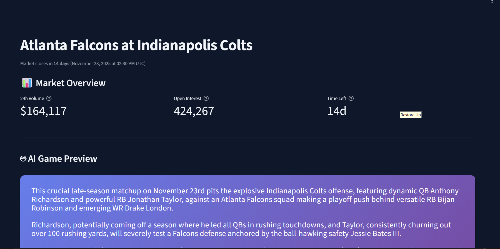

# OddSense 📊

**AI-Powered NFL Prediction Market Analysis Platform**

OddSense is a comprehensive analytics platform that bridges prediction markets (Kalshi) with traditional sportsbooks and real-time sports data. Get AI-generated game previews, compare market odds, track historical accuracy, and make more informed betting decisions.



## 🌟 Features

### 🤖 AI-Powered Game Previews
- **Google Gemini 2.5 Flash** generates personalized game analysis
- Highlights 2-3 key players per team with positions and recent stats
- Tactical matchup insights and critical factors
- Context-aware analysis using market probabilities

### 📊 Comprehensive Market Data
- **Kalshi Prediction Markets**: Real-time NFL game outcome probabilities
- **Sportsbook Odds Integration**: Compare against DraftKings, FanDuel, BetMGM, and more
- **Market Consensus**: Aggregated probability across multiple bookmakers
- **Best Odds Discovery**: Find the most favorable lines automatically

### 📈 Historical Performance Tracking
- **ESPN Game Results**: Verify prediction accuracy against actual outcomes
- **Market Accuracy Analysis**: See how well prediction markets performed
- **Player Statistics**: Access team stat leaders and key player metrics

### 💹 Advanced Analytics
- **Price Movement Charts**: Track probability changes over time with Plotly visualizations
- **Volume Analysis**: Monitor trading activity and market liquidity
- **Order Book Data**: View pending buy/sell orders for deeper market insights
- **Quality Indicators**: Color-coded signals (Strong Favorite, Underdog, Toss-Up, etc.)

### 🎨 Modern UI/UX
- **Mobile-First Design**: Optimized responsive interface for all devices
- **Dark Mode**: Figma-inspired aesthetic with clean market cards
- **Smart Filtering**: Filter by sport (NFL, NBA, MLB, NHL) with search functionality
- **Efficient Navigation**: Pagination and collapsible sections for optimal mobile viewing

## 🚀 Quick Start

### Prerequisites
- Python 3.11+
- API Keys (see Configuration section)

### Installation

1. **Fork this repository** on Replit or clone locally:
```bash
git clone https://github.com/yourusername/oddsense.git
cd oddsense
```

2. **Install dependencies:**
```bash
pip install -r requirements.txt
```

3. **Configure environment variables** (see Configuration below)

4. **Run the application:**
```bash
streamlit run app.py --server.port 5000
```

5. **Access the app** at `http://0.0.0.0:5000`

## ⚙️ Configuration

### Required API Keys

Add these to your environment variables (Secrets on Replit):

```bash
# Google Gemini (AI Game Previews)
GEMINI_API_KEY=your_gemini_api_key

# The Odds API (Sportsbook Data)
ODDS_API_KEY=your_odds_api_key
```

### Optional Configuration

```bash
# Custom context service URL (default: http://localhost:8000)
CONTEXT_URL=http://your-context-service-url
```

### Getting API Keys

- **Gemini API**: Get a free key at [Google AI Studio](https://aistudio.google.com/apikey)
- **The Odds API**: Sign up at [The Odds API](https://the-odds-api.com/) (free tier available)

## 🏗️ Architecture

### Service-Oriented Design

```
app.py (Streamlit UI)
├── kalshi_service.py       # Kalshi prediction market data
├── odds_api_service.py     # Sportsbook odds aggregation
├── espn_service.py         # Game results & player stats
├── gemini_service.py       # AI game preview generation
└── openai_service.py       # Market analysis (optional)
```

### Key Components

- **KalshiService**: Fetches and normalizes NFL prediction markets from Kalshi API
- **OddsAPIService**: Aggregates sportsbook odds with 5-minute caching
- **ESPNService**: Provides game results, team stats, and historical accuracy
- **GeminiService**: Generates engaging AI-powered game summaries
- **Market Normalization**: Comprehensive team name mapping and data transformation

## 📱 Usage

### Browse Markets
1. Select a sport filter (NFL, NBA, MLB, NHL) or view all markets
2. Use search to find specific teams or matchups
3. View quick metrics: 24h volume, open interest, time remaining, sportsbook consensus

### Analyze Games
1. Click "View Details" on any market card
2. Read AI-generated game preview with player insights
3. Compare Kalshi probabilities vs sportsbook odds
4. Review historical price movements and trading volume
5. Explore order book depth (for advanced traders)

### Track Accuracy
1. After games finish, view "Market Prediction vs Actual Result"
2. See if the prediction market was correct
3. Analyze confidence levels and upset alerts

## 🔧 Technical Details

### Data Sources
- **Kalshi Trading API**: Public NFL game markets (`KXNFLGAME` series)
- **The Odds API**: Multi-sportsbook aggregation (US markets)
- **ESPN API**: Game results, team rosters, player statistics

### Caching Strategy
- **Odds API**: 5-minute cache to minimize API usage and costs
- **Session State**: Maintains navigation and filter preferences

### Probability Calculations
- **American to Decimal**: Converts moneyline odds to implied probabilities
- **Market Consensus**: Averages across all available sportsbooks
- **Best Odds**: Identifies most favorable lines per team

## 📊 Data Visualization

Built with **Plotly** for interactive charts:
- Historical price movement (OHLC candlesticks)
- Trading volume over time
- Dark mode optimized for readability

## 🤝 Contributing

Contributions are welcome! Please feel free to submit a Pull Request.

### Development Setup
1. Fork the repository
2. Create a feature branch (`git checkout -b feature/AmazingFeature`)
3. Commit your changes (`git commit -m 'Add some AmazingFeature'`)
4. Push to the branch (`git push origin feature/AmazingFeature`)
5. Open a Pull Request

## 📝 License

This project is open source and available under the [MIT License](LICENSE).

## 🙏 Acknowledgments

- **Kalshi** for providing prediction market data
- **The Odds API** for sportsbook odds aggregation
- **ESPN** for game results and player statistics
- **Google Gemini** for AI-powered game analysis
- **Streamlit** for the web framework

## 📧 Contact

For questions or feedback, please open an issue on GitHub.

---

**Built with ❤️ on Replit**

[View on Replit](https://replit.com/@yourusername/oddsense)
